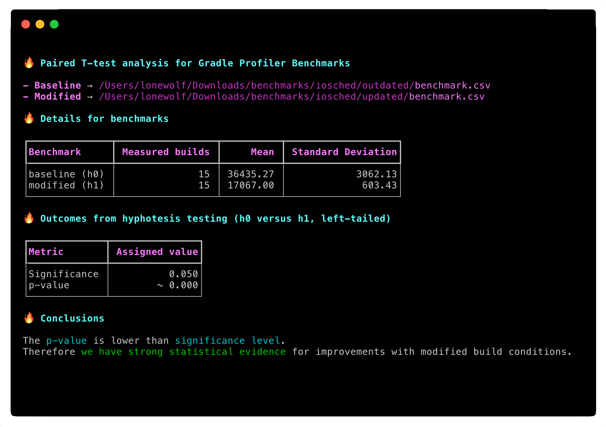

# Paired T-tests for Gradle Benchmarks

> _Complete blog post to come. Stay tunned_


## Context

`gradle-profiler-pttest` can analyse the outcomes of two benchmarks generated by [Gradle Profiler](https://github.com/gradle/gradle-profiler) with the [Paired T-test statistical technique](https://en.wikipedia.org/wiki/Student%27s_t-test). 

The goal is provide an easy way to compare two benchmarks for Gradle builds without being [mislead by simple means](https://thinkingneuron.com/statistics-data-science-why-mean-misleading/), since we are leveraging robust statistical evidence on top of the outcomes. 

This tool is built on top of [pingouin](https://pingouin-stats.org/), an opinionated Statistics library which leverages NumPy, Pandas and SciPy. Among other things, `gradle-profiler-pttest` features : 

- An opinionated [hyphotesis test](https://en.wikipedia.org/wiki/Statistical_hypothesis_testing) (left-tailed) where we want to test that **modified build conditions** (_h0_) have a mean **statistically lower** than **baseline build conditions** (_h1_), which means better execution times given the modifications under test 
- Auto-correction for benchmark samples with different sizes

Note that the ideal size for samples/benchmarks should be a small - ideally between 10 and 30 measured builds - in order to make sense of T-student analysis.

## Install with pip

Install from your CLI with `pip`


```shell
pip install gradle-profiler-pttest
```

Requires Python 3.8.+.

## Using

- Run the benchmarks with Gradle profiler for the status quo (`baseline`) and for the modifications applied the your Gradle project (`modified`)

- Supply the generated CSV files to `gradle-profiler-pttest` 

```bash
gradle-profiler-pttest \
	-b <path/to/baseline/benchmark.csv> \
	-m <path/to/modified/benchmark.csv>
```

- Profit results




## Contributing

- Ensure you have Python 3.8.+ 
- Ensure you have flake8 support in your text editor / IDE
- Check our [contribution guidelines](./CONTRIBUTING.md)
- Make sure you have a green build

```
make flake8
make test
```
- Summit your PR 🔥

## Author

Coded by Ubiratan Soares (follow me on [Twitter](https://twitter.com/ubiratanfsoares))

## License

```
The MIT License (MIT)

Copyright (c) 2020 Dotanuki Labs

Permission is hereby granted, free of charge, to any person obtaining a copy of
this software and associated documentation files (the "Software"), to deal in
the Software without restriction, including without limitation the rights to
use, copy, modify, merge, publish, distribute, sublicense, and/or sell copies of
the Software, and to permit persons to whom the Software is furnished to do so,
subject to the following conditions:

The above copyright notice and this permission notice shall be included in all
copies or substantial portions of the Software.

THE SOFTWARE IS PROVIDED "AS IS", WITHOUT WARRANTY OF ANY KIND, EXPRESS OR
IMPLIED, INCLUDING BUT NOT LIMITED TO THE WARRANTIES OF MERCHANTABILITY, FITNESS
FOR A PARTICULAR PURPOSE AND NONINFRINGEMENT. IN NO EVENT SHALL THE AUTHORS OR
COPYRIGHT HOLDERS BE LIABLE FOR ANY CLAIM, DAMAGES OR OTHER LIABILITY, WHETHER
IN AN ACTION OF CONTRACT, TORT OR OTHERWISE, ARISING FROM, OUT OF OR IN
CONNECTION WITH THE SOFTWARE OR THE USE OR OTHER DEALINGS IN THE SOFTWARE.
```
