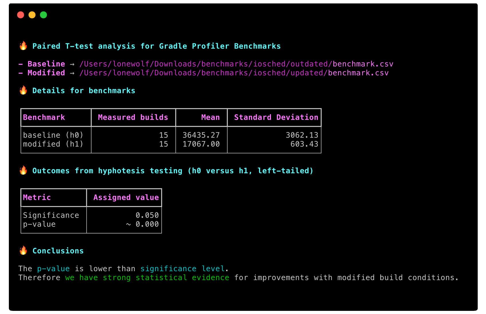

# Gradle Profiler - Paired T-test analyser

> Analyses the outcomes of two Gradle Profiler benchmarks with the Paired T-test statistical technique

## Context

> Complete blog post to come. Stay tunned

## Install with pip

```shell
pip install gradle-profiler-pttest
```

Requires Python 3.8.+..

## Using

- Run benchmarks with Gradle profiler for the status quo (`baseline`) and for the modification applied the your Gradle project (`modified`)

- Pass generated CSV files to `gradle-profiler-pttest` 

```bash

gradle-profiler-pttest \
	-b <path/to/baseline/benchmark.csv> \
	-m <path/to/modified/benchmark.csv>
	
```

- Profit the results



## Under the hood

// TODO

## Contributing

- Ensure you have Python 3.8.+ 
- Ensure you have flake8 support in your text editor / IDE
- Check our [contribution guidelines](./CONTRIBUTING.md)
- Make sure you have a gree build

```
make flake8
make test
```
- Summit your PR 🔥

## Author

Coded by Ubiratan Soares (follow me on [Twitter](https://twitter.com/ubiratanfsoares))

## License

```
The MIT License (MIT)

Copyright (c) 2020 Dotanuki Labs

Permission is hereby granted, free of charge, to any person obtaining a copy of
this software and associated documentation files (the "Software"), to deal in
the Software without restriction, including without limitation the rights to
use, copy, modify, merge, publish, distribute, sublicense, and/or sell copies of
the Software, and to permit persons to whom the Software is furnished to do so,
subject to the following conditions:

The above copyright notice and this permission notice shall be included in all
copies or substantial portions of the Software.

THE SOFTWARE IS PROVIDED "AS IS", WITHOUT WARRANTY OF ANY KIND, EXPRESS OR
IMPLIED, INCLUDING BUT NOT LIMITED TO THE WARRANTIES OF MERCHANTABILITY, FITNESS
FOR A PARTICULAR PURPOSE AND NONINFRINGEMENT. IN NO EVENT SHALL THE AUTHORS OR
COPYRIGHT HOLDERS BE LIABLE FOR ANY CLAIM, DAMAGES OR OTHER LIABILITY, WHETHER
IN AN ACTION OF CONTRACT, TORT OR OTHERWISE, ARISING FROM, OUT OF OR IN
CONNECTION WITH THE SOFTWARE OR THE USE OR OTHER DEALINGS IN THE SOFTWARE.
```
